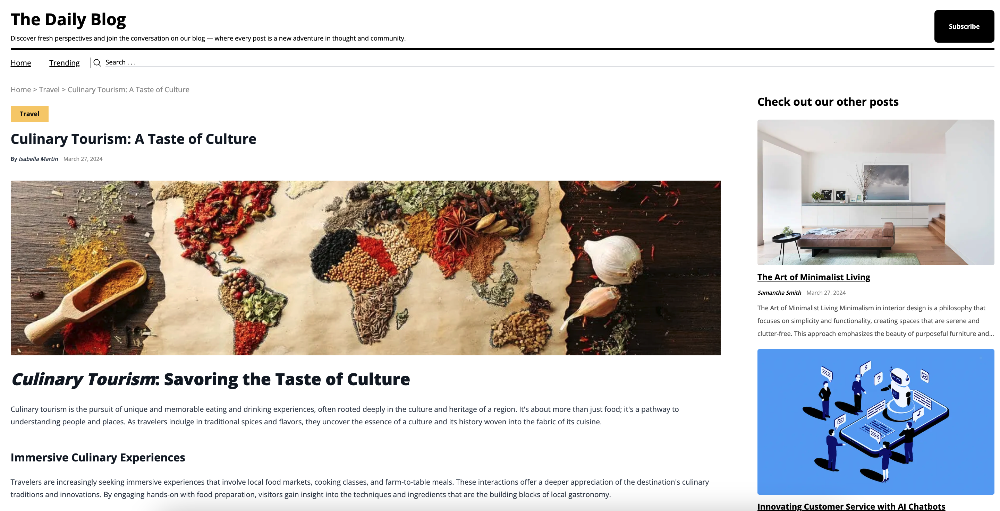

<a name="readme-top"></a>

<!-- PROJECT LOGO -->
<br />
<div align="center">
  <a href="https://thedailyblog-cef4de6cc286.herokuapp.com/">
    
  </a>

<h2 align="center">The Daily Blog</h3>

  <p align="center">
Discover fresh perspectives and join the conversation on our blog — where every post is a new adventure in thought and communit
  </p>

  # <a href="https://thedailyblog-cef4de6cc286.herokuapp.com">Live Demo</a>

</div>


<!-- TABLE OF CONTENTS -->
<details>
  <summary>Table of Contents</summary>
  <ol>
    <li><a href="#about-the-project">About The Project</a></li>
    <li><a href="#major-technologies-used">Major Technologies Used</a></li>
    <li><a href="#installation">Installation</a></li>
    <li><a href="#usage">Usage</a></li>
    <li><a href="#next-steps">Next Steps</a></li>
    <li><a href="#license">License</a></li>
    <li><a href="#contact">Contact</a></li>
    <li><a href="#acknowledgments">Acknowledgments</a></li>
  </ol>
</details>


<!-- ABOUT THE PROJECT -->
## About The Project

The goal of this project was to create a full-stack web application where the owner can upload daily blog updates on a variety of topics. The application features a clean and responsive user interface that allows readers to easily browse and engage with the content.

1. <strong>Home Page</strong>: The "Home" page offers a modern UI/UX interface where users can explore the latest blog posts. The posts are organized into the following sections:
    <br>
    - Trending: This section highlights the posts that are generating the most discussion and engagement among readers. It surfaces the most popular and thought-provoking content.
    - Technology: This section is dedicated to the latest news, insights, and tutorials on emerging technologies such as AI, blockchain, cloud computing, and more.
    - Travel: This section provides readers with inspiring stories, destination guides, and travel tips from around the world, helping them plan their next adventure.
    - All Posts: This section shows a comprehensive list of all the blog posts, allowing users to easily navigate and discover new content.


2. <strong>Each Blog Page</strong>: Using Next.js, each blog has a separate page that allows users to read the blog's contents. Some features of each page include:
    - Content: This section includes the blog's title, date posted, author, pictures, and the full blog content.
    - Other Posts: A UI on the right side of the page allows users to check out other blog posts.




<!-- TECHNOLOGIES -->
### Major Technologies Used

##### Front-End:
[](https://nextjs.org/)
[](https://www.typescriptlang.org/)
[](https://react.dev/)
[]()
[](https://tailwindcss.com/)

##### Back-End:
[](https://www.javascript.com/)
[](https://www.prisma.io/)
[](https://aws.amazon.com/rds/?did=ft_card&trk=ft_card)
[](https://www.mysql.com/)

##### Deployment:
[](https://www.heroku.com/platform)


## Installation

Please follow instructions below to install and run the project on your local device.


1. Clone the repository.
   ```sh
   git clone https://github.com/bilalrashid0197/the-daily-blog.git
   ```
2. Install NPM packages in client and server folders.
   ```sh
   cd app && npm install
   ```
5. Run the the development server on your local machine.
    ```sh
    cd app && npm run dev
    ```

## Usage
Please access the [Live Demo](https://thedailyblog-cef4de6cc286.herokuapp.com/) for this project.


## Next Steps

- **Anonymous Commenting System**: Implement a feature that allows users to post comments anonymously. This will include like and dislike options for each comment to gauge reader engagement and sentiment.

- **Enhanced Search Functionality**: Develop an advanced search feature that enables users to efficiently locate their favorite articles using specific keywords or phrases.

- **Authentication Module**: Create a secure authentication system that supports user registration and login, enhancing user interaction and personalization on the platform.

<!-- LICENSE -->
## License

Distributed under the MIT License. See `LICENSE.txt` for more information.
<!-- CONTACT -->
## Contact

Bilal Rashid

- Email: rash8510@mylaurier.ca
- LinkedIn: https://www.linkedin.com/in/bilal-rashid-a04625198/


